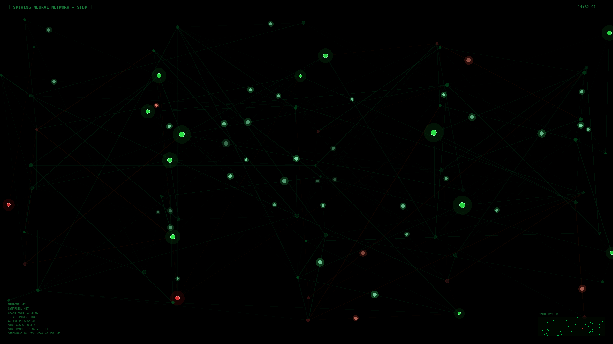

# Spiking Neural Network Screensaver

A screensaver that simulates a spiking neural network with Spike-Timing Dependent Plasticity (STDP). Neurons fire, propagate spikes along synapses, and synaptic weights evolve in real-time following Hebbian learning rules.



## Features

- **60+ neurons** organized in 5 layers with excitatory (green) and inhibitory (red) populations
- **STDP learning** — synaptic weights change based on relative spike timing:
  - Pre-before-post (causal) → Long-Term Potentiation (LTP, weight increase)
  - Post-before-pre (anti-causal) → Long-Term Depression (LTD, weight decrease)
- **Synaptic weight visualization** — line width and brightness reflect current weight (thicker = stronger synapse)
- **Spike raster plot** — real-time display of network spiking activity
- **HUD** — live statistics including spike rate, synapse count, STDP weight distribution
- **Spontaneous activity and periodic stimulation** to maintain ongoing dynamics
- Lightweight — runs at ~30fps, suitable for low-power hardware (tested on Intel Atom)

## Dependencies

- Python 3
- `python3-tk` (Tkinter)
- `xscreensaver` (optional, for screensaver integration)

## Installation

### Quick install

```bash
git clone git@github.com:federicohyo/spiking-neural-screensaver.git
cd spiking-neural-screensaver
./install.sh
```

The install script will:
1. Check and prompt for missing dependencies
2. Copy the screensaver to `~/.screensavers/`
3. Configure `xscreensaver` to use it
4. Set up autostart on login

### Manual install

1. Install dependencies:

```bash
sudo apt-get install -y python3-tk xscreensaver xscreensaver-data
```

2. Copy the screensaver:

```bash
mkdir -p ~/.screensavers
cp neural-spike ~/.screensavers/
chmod +x ~/.screensavers/neural-spike
```

3. Configure xscreensaver — edit `~/.xscreensaver` and add to the `programs:` section:

```
"/home/YOUR_USER/.screensavers/neural-spike"                         \n
```

4. Start xscreensaver:

```bash
xscreensaver -nosplash &
```

5. (Optional) Autostart on login — create `~/.config/autostart/xscreensaver.desktop`:

```ini
[Desktop Entry]
Type=Application
Name=XScreenSaver
Exec=xscreensaver -nosplash
Hidden=false
NoDisplay=false
X-GNOME-Autostart-enabled=true
```

## Usage

### Test standalone (fullscreen)

```bash
python3 ~/.screensavers/neural-spike
```

Press **Escape** or move the mouse to exit.

### Activate via xscreensaver

```bash
xscreensaver-command -activate
```

### HTML version

An HTML/JavaScript version is also included (`neural_spike.html`). Open it in any browser for a canvas-based visualization.

## STDP Parameters

The STDP learning rule parameters can be tuned at the top of `neural-spike`:

| Parameter | Default | Description |
|-----------|---------|-------------|
| `STDP_A_PLUS` | 0.02 | LTP amplitude |
| `STDP_A_MINUS` | 0.015 | LTD amplitude |
| `STDP_TAU_PLUS` | 20.0 | LTP time constant (frames) |
| `STDP_TAU_MINUS` | 25.0 | LTD time constant (frames) |
| `STDP_W_MIN` | 0.05 | Minimum synaptic weight |
| `STDP_W_MAX` | 1.2 | Maximum synaptic weight |

## How it works

- Neurons accumulate membrane potential from incoming spikes and spontaneous activity
- When potential crosses threshold (1.0), the neuron fires and enters a refractory period
- Spikes travel along synapses with propagation delays proportional to distance
- At each spike event, STDP is applied: if pre-synaptic neuron fires shortly before post-synaptic neuron (causal timing), the synapse is strengthened; reverse timing weakens it
- Inhibitory neurons (~18%) suppress connected neurons, preventing runaway excitation
- Over time, frequently co-activated pathways become thicker (visible as brighter, wider lines)

## License

MIT
